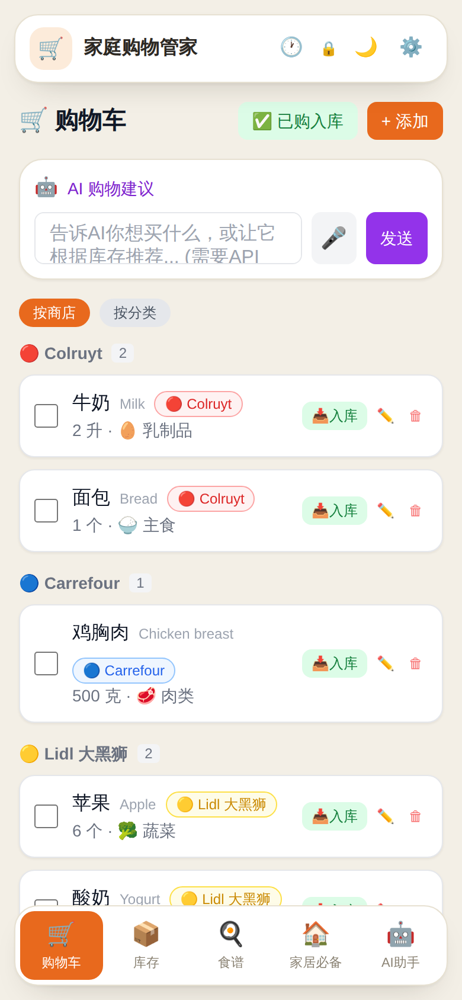
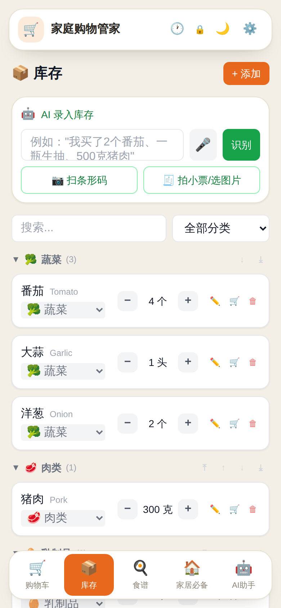
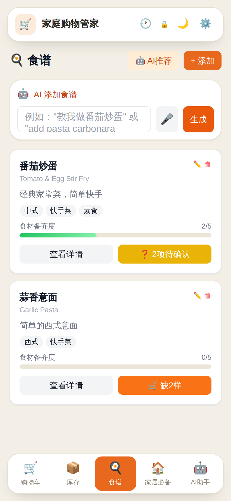
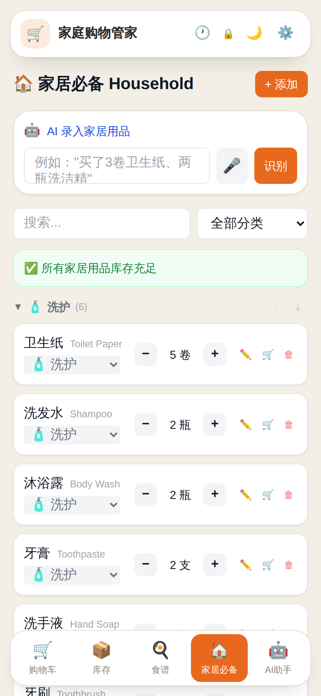

# Home Manager 🏠

> What's in the house, what still needs buying, what you can cook tonight.
> Open the URL and it works — no account, and your data stays on your phone.

**Open it:** https://alanine4.github.io/home-manager/ ｜ **中文:** [README.md](README.md)

  
  
  
  

Cart · Inventory · Recipes · Household (dark mode too)

---

## What it is

People sharing a kitchen buy the same thing twice, forget what is already in the
cupboard, and start cooking before noticing an ingredient is missing. This keeps
track of three things: **what you have, what you need to buy, and what you can
cook tonight with what's already there.**

It is just a web page. Open it and it works, storing everything on your phone.
Want receipts scanned automatically, or to add things by saying a sentence? Add an
AI key. Want to share one list with the people you live with? Set up sync. Both
are optional; the app is complete without them.

---

## How to use it

Open https://alanine4.github.io/home-manager/ and **add it to your home screen**.
It then looks and behaves like an app, and **keeps working with no network**.

- **iPhone:** open in Safari → Share → Add to Home Screen
- **Android:** open in Chrome → menu → Add to Home Screen
- **Computer:** open in Chrome / Edge → install icon in the address bar

| | Online | On the home screen, offline |
|---|:---:|:---:|
| Cart, inventory, recipes, household | ✅ | ✅ |
| Barcode scanning | ✅ | scans, but can't look up the name |
| Receipt scan / voice input / AI suggestions | ✅ | needs network |
| Sync with family | ✅ once set up | needs network |

Everything is stored on your own device. Until you turn on sync yourself,
nothing leaves your phone.

---

## Features

### 🛒 Shopping cart
- Group by store (Colruyt / Carrefour / Lidl, add your own) or by category
- Tick what you bought → move everything to inventory in one tap
- Say "I need tomatoes and pork" and the AI adds them

### 📦 Food inventory
- Categories you can collapse, reorder and pin
- Scan a barcode to fill in the name (via the public Open Food Facts database)
- Photograph a receipt → the AI reads it, in Dutch, French, English, whatever
- Voice input

### 🍳 Recipes
- Each recipe shows how many of its ingredients you already have
- Add the missing ones to the cart in one tap
- AI suggests what to cook from what's in stock

### 🏠 Household supplies
- Toiletries, cleaning products and everyday items, kept apart from food
- Warns you when something is running low

### 🤖 AI assistant (optional)
- 14 providers — Gemini, Claude, DeepSeek, Qwen, Kimi, GLM, MiniMax and more —
  using your own key
- For GPT models, pick OpenRouter
- Chat with it and let it add to the cart or save a recipe for you

### 🔄 Sync with family (optional, off by default)
- Two people enter the same room code and share one list, updated live
- Every change is logged and can be undone with one tap

---

## Where your data lives

By default, everything is in your phone browser's local storage, including your
AI key and sync settings. Nothing is uploaded and nothing ends up in this repo.

**Which also means: clearing your browser data clears your inventory.** The only
reliable backup right now is **Settings → Data → Export**, saved somewhere safe
every so often.

Known ways to lose it:
- Clearing browser cache / site data by hand
- Switching browsers or phones
- On iPhone, not opening Safari for a long time — iOS may evict site data

Automatic backup isn't built yet; it's item 2 in [ROADMAP.md](ROADMAP.md).

---

## Sync with family (optional)

Without it, the app works fully — each device just keeps its own list. You only
need this to share one list with someone, or to keep your phone and laptop in
step.

1. Go to https://console.firebase.google.com, create a project, add a
   **Realtime Database**
2. In the project settings, find the web app config and copy the whole thing
3. Back in the app: **Settings → Cloud sync**, paste it, save
4. Copy the contents of `database.rules.json` from this repo into the Firebase
   console → Realtime Database → Rules, and publish
5. Repeat step 3 on the other person's phone, then give them your **room code**
   to enter in Settings

Until you do this, the app never connects to any server. Once it's on and you
want a one-off session without sync (peeking at the list on someone else's
computer, say), add `?mode=local` to the URL.

---

## Run your own copy

This repo contains nobody's sync configuration, mine included. A fork can't
accidentally connect to anyone else's data; each deployment supplies its own.

1. Fork this repo and turn on GitHub Pages in its settings
2. Open your own URL — it works right away

There is no step 3. Renaming the repo needs no code changes either.

---

## Things worth knowing

- **The room code is the key.** Anyone who has it can see and edit the list, and
  there is no way to remove them. Treat it like a password: not in screenshots,
  not in public posts.
- If two people edit the **same item at the same moment**, the later save wins.
  Fine for groceries, not for heavy simultaneous editing.
- Local storage is not a backup. Export regularly.
- Barcode scanning doesn't work in Safari on iPhone yet; Android, Chrome and
  Edge are fine.
- Voice input needs a network connection.

---

## FAQ

**Do I need to be online?**
No. Once it's on your home screen it works without a network. Only receipt
scanning, voice input, AI suggestions and sync need one.

**Do I need an AI key?**
No. Everything works with manual entry; the AI just makes it faster.

**How do I move to a new phone?**
Export from Settings, import on the new phone. Or turn on sync and use the same
room code on both.

**What if my room code leaks?**
Switch to a new room code in Settings and push your data there. The old copy
stays in the cloud, but you stop using it.

**Why is there no login?**
Because that needs a server I'd have to run, and the whole point of this app is
that it doesn't. The room code is the compromise between "no account" and "two
people can share a list". That will be revisited once there are real users.

---

## What's next

See [ROADMAP.md](ROADMAP.md) — it also records what was decided **against**, and why.

## Contributing

Issues and pull requests are welcome. Please read [CONTRIBUTING.md](CONTRIBUTING.md)
before changing code.

## License

MIT. See [LICENSE](LICENSE).
